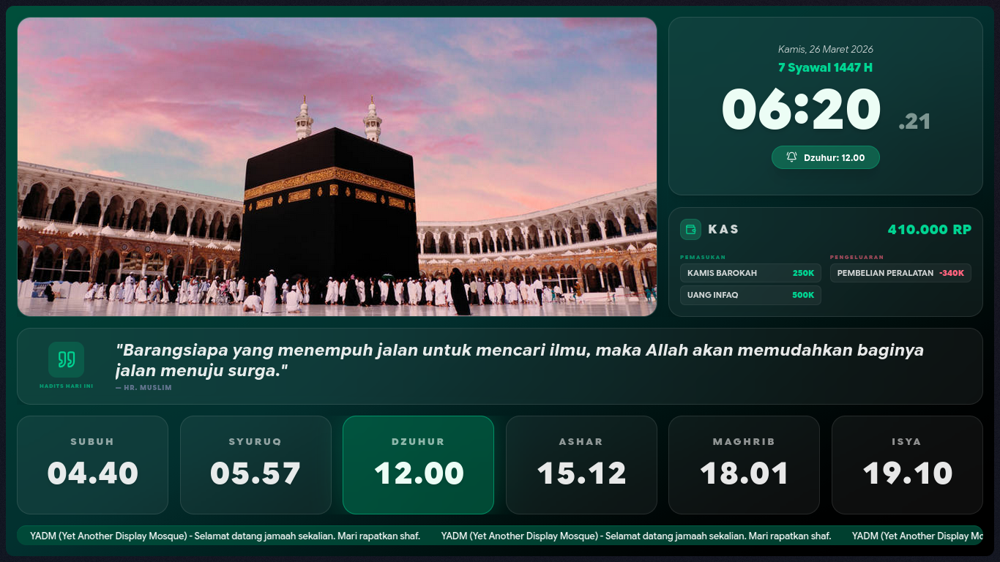
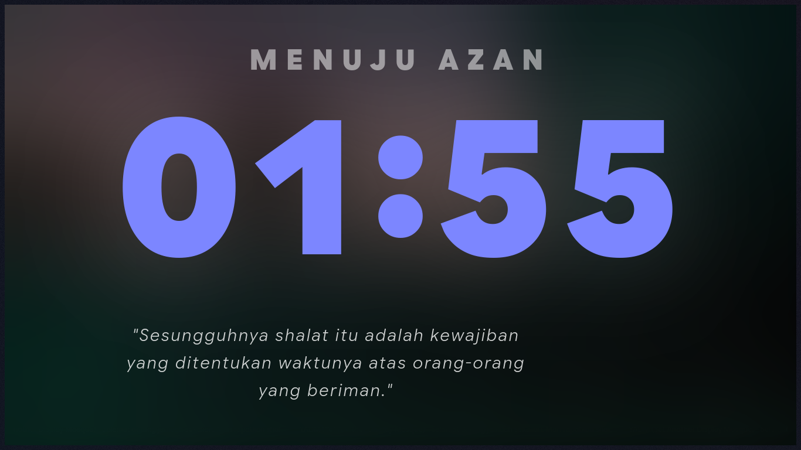
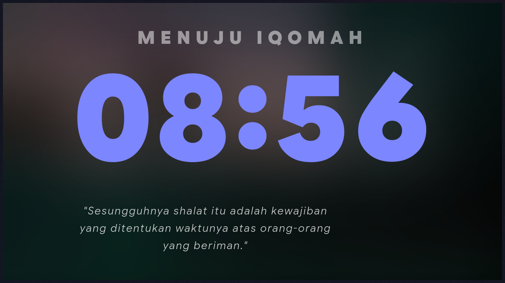
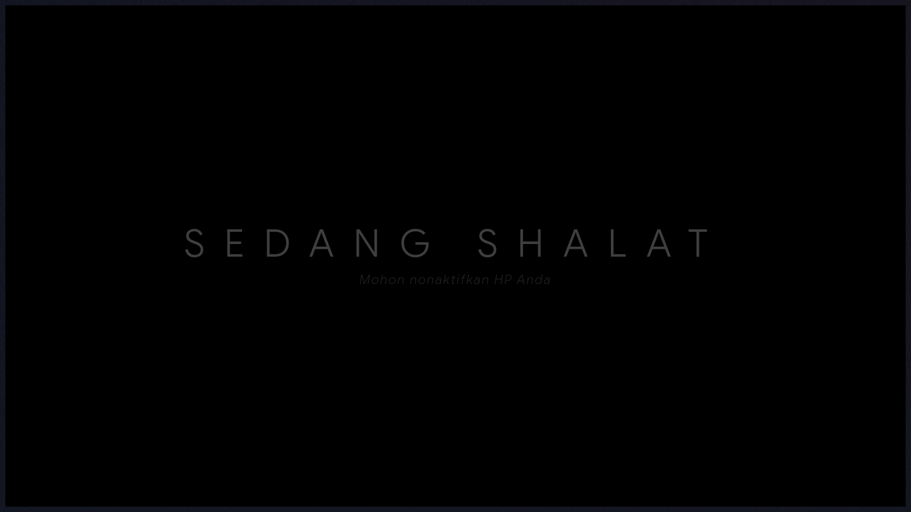
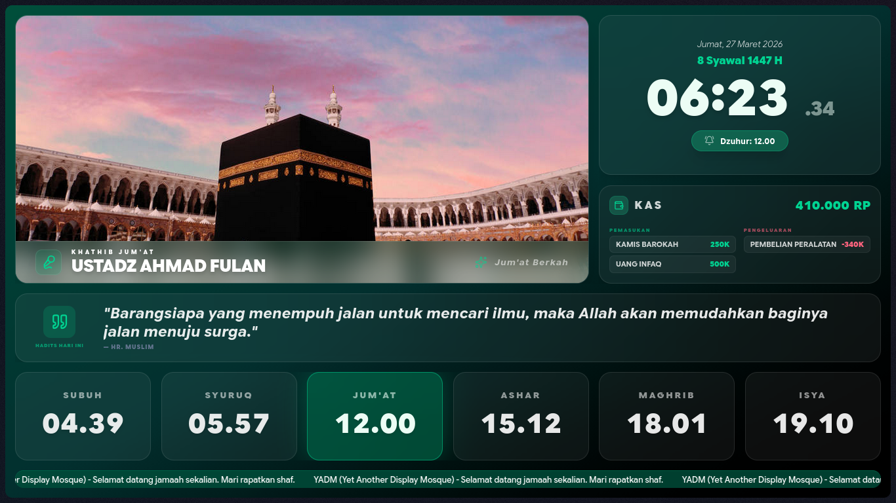
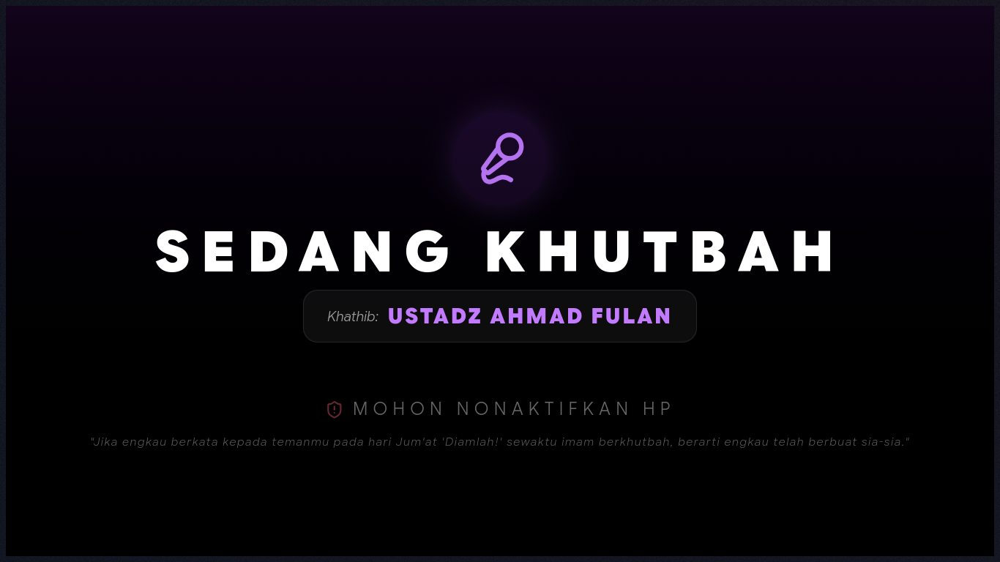
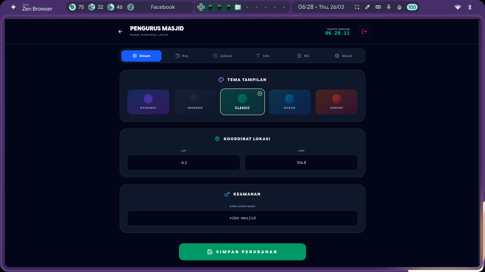
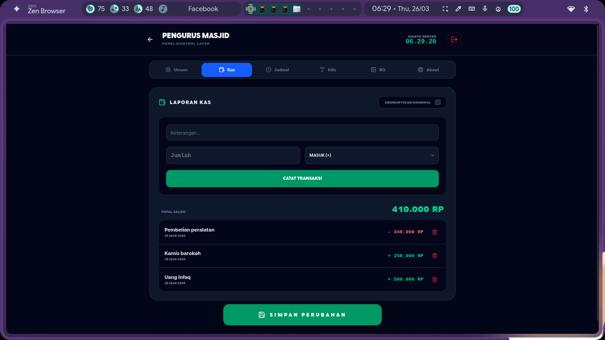
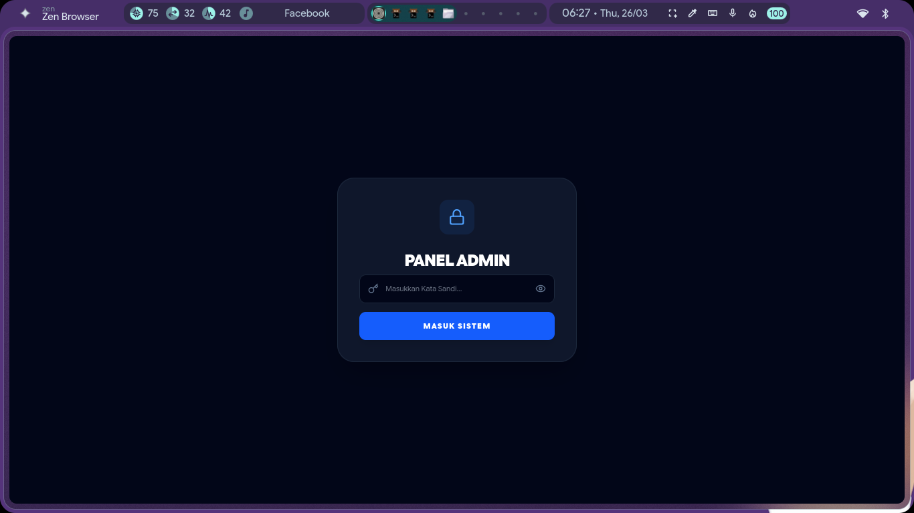

# 🕋 Al-Ye'AnDiMo (Alhamdulillah It's Yet Another Display Mosque)

[Bahasa Indonesia](README.md) | **English**


[](https://al-yeandimo-demo.vercel.app/)

> **🚀 TRY THE LIVE DEMO HERE:** [al-yeandimo-demo.vercel.app](https://al-yeandimo-demo.vercel.app/)

> **⚠️ DISCLAIMER:** This is NOT "Yet Another Dotfiles Manager". We don't manage your `.bashrc`, we manage your mosque's prayer times so the congregation isn't late. Al-Ye'AnDiMo is an aesthetic, modern, and easy-to-manage mosque information display solution.

**Al-Ye'AnDiMo** is a "vibe-centric" mosque information display system designed specifically for 1080p screens. Built with the latest technology for the benefit of the Ummah.

## ✨ Key Features

- 🕋 **Automatic Prayer Schedule**: Precision calculation based on location coordinates (Lat/Lng).
- ⚡ **Real-time Sync (SSE)**: Changes in the Admin Panel appear instantly on the screen without refreshing.
- 🎨 **Dynamic Themes**: Choose from various themes (Modern, Classic, Ocean, Sunset, etc.) that adapt to the atmosphere.
- 🖼️ **Slideshow Background**: Easily upload photos of mosque activities or landscapes.
- 💰 **Cash Management (BETA)**: Transparent recording of income & expenses (Available to try in the latest build).
- 📜 **Information & Scrolling Text**: Convey announcements or hadiths with an elegant style.
- 🕌 **Friday Mode**: Specialized display for Khatib names and khutbah duration.
- 🔄 **Auto-Update via Admin Panel**: Update directly from the About tab — no SSH or terminal needed.

## 📸 Display Gallery

<details>
<summary><b>✨ Click to view display gallery (Main Display & Admin Panel)</b></summary>

### 📺 Main Display (TV View)

Elegant and informative main display for the congregation.

|            Main Dashboard             |             Adhan Mode             |
| :-----------------------------------: | :--------------------------------: |
|  |  |
|           _Main Dashboard_            |        _Adhan Notification_        |

|              Iqomah Mode               |              Prayer Mode               |
| :------------------------------------: | :------------------------------------: |
|  |  |
|           _Iqomah Countdown_           |      _Prayer Instruction Screen_       |

|             Friday Mode              |               Khutbah Mode               |
| :----------------------------------: | :--------------------------------------: |
|  |  |
|        _Khatib & Muazin Info_        |          _Friday Khutbah Timer_          |

### 📱 Admin Panel (Settings)

Manage all display content easily via Mobile or PC.

|            Desktop (Admin)            |            Mobile (Admin)             |
| :-----------------------------------: | :-----------------------------------: |
|  |  |
|        _Settings via Desktop_         |        _Responsive on Mobile_         |

|       Cash Management        |          Lock Screen           |
| :--------------------------: | :----------------------------: |
|  |  |
|   _Financial Transparency_   |    _Panel Access Security_     |

</details>

## 🆕 What's New in v1.1.0

- **🔄 Auto-Update**: Update directly from Admin Panel → About tab. No SSH or terminal required.
- **🔒 Security Hardening**: CSP (Content Security Policy) headers strengthened for XSS protection.
- **⚡ Safe update process**: Automatic backup of data & uploads before updating, restore if anything goes wrong.
- **📱 Smart version detection**: Numeric semver comparison — knows exactly whether your version is up-to-date.

> 🚀 **v1.1.0 is the auto-update release. From now on, anyone can update the system — even without technical experience.**

## 🛠️ Tech Stack

- **Framework**: [Svelte 5](https://svelte.dev/) (Runes)
- **Meta-framework**: [SvelteKit](https://kit.svelte.dev/)
- **Styling**: [TailwindCSS](https://tailwindcss.com/)
- **Icons**: [Lucide Svelte](https://lucide.dev/)
- **Communication**: Server-Sent Events (SSE)

## 🚀 Installation & Setup Guide

For mosque administrators who want to install this system, please read the full guide at:

👉 **[INSTALLATION & SETUP GUIDE (MOSQUE_INSTALL.md)](MOSQUE_INSTALL.md)**

## 📦 Download & Installation

### New Users
1. Download the ZIP file from the **[Releases](https://github.com/nyanpoketto-kujira/Yet-Another-Display-Mosque/releases)** page for your OS
2. Extract and run `start.sh` (Linux) or `start.bat` (Windows)
3. Open `http://localhost:3000` in your browser

👉 Full guide → **[INSTALL.md](INSTALL.md)** (Android TV, Linux, Windows)

### Updating to a New Version

#### 🆕 v1.1.0+ — Auto-Update via Admin Panel (Easiest)
1. Open Admin Panel → **About** tab
2. Click **"Check for Updates"**
3. If a new version is available, click **"Update & Restart"**
4. The server will automatically download, backup data, and restart

#### v1.0.6 and below — Manual Script
For older versions only:
```bash
cd yadm-folder
bash scripts/update.sh
```

## 🛠️ Development (For Developers)

1. **Clone Repository**

   ```bash
   git clone https://github.com/nyanpoketto-kujira/Yet-Another-Display-Mosque.git
   cd Yet-Another-Display-Mosque
   ```

2. **Install Dependencies**

   ```bash
   pnpm install
   ```

3. **Run Development Mode**

   ```bash
   pnpm dev
   ```

4. **Build Runner Package**
   ```bash
   bash build.sh
   # Output: dist/yadm-<version>-linux-x64.zip and -windows-x64.zip
   ```

## 📝 License

This project is under the MIT License. Feel free to use and modify for the benefit of the community.

---

Made with ❤️ by [nyanpoketto-kujira](https://github.com/nyanpoketto-kujira)
