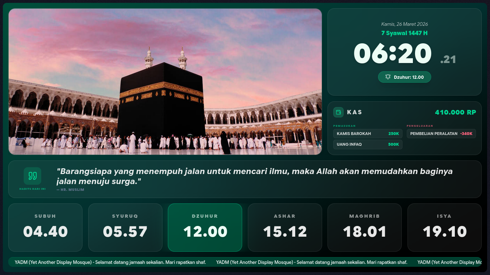
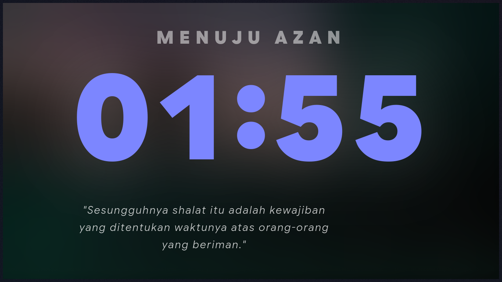
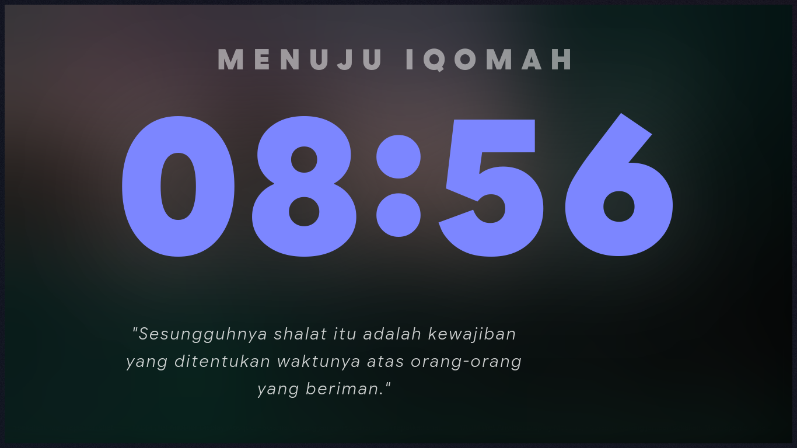
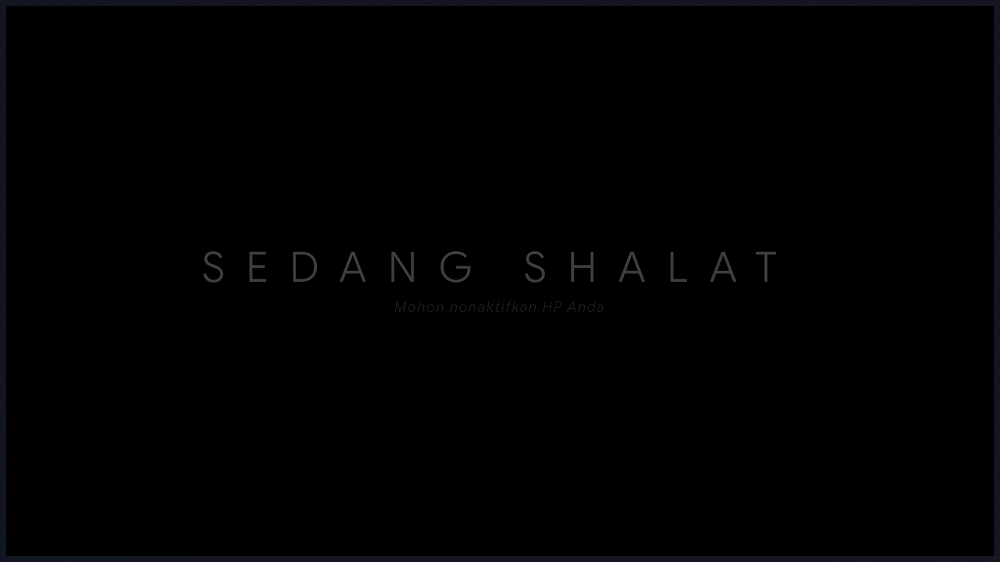
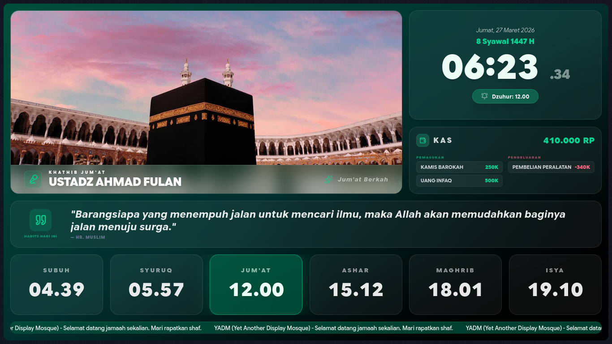
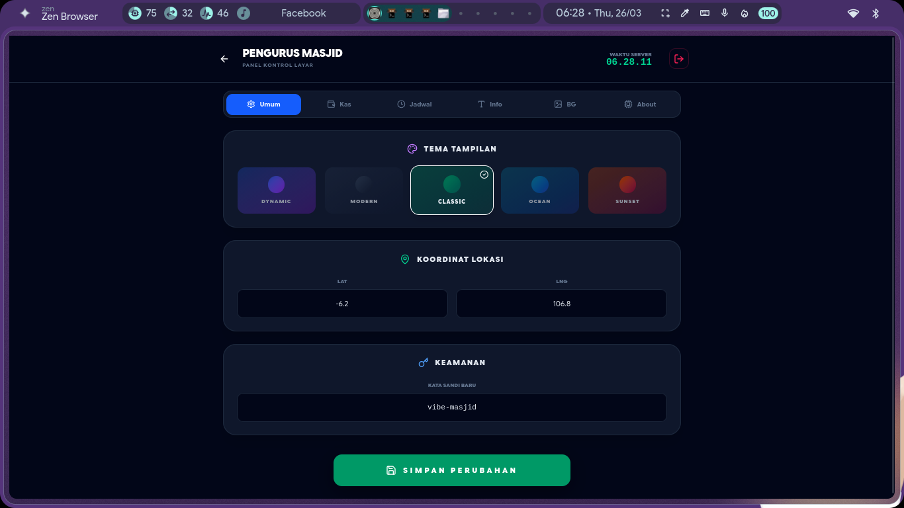
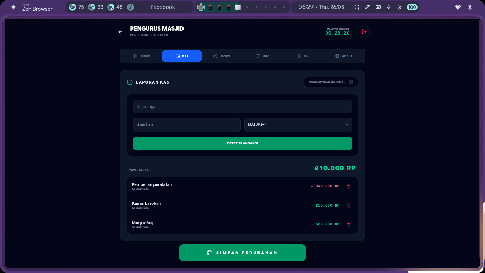
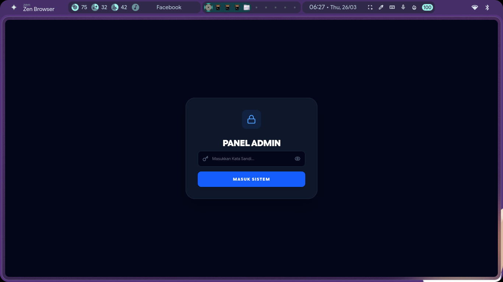

# 🕋 Al-Ye'AnDiMo (Alhamdulillah It's Yet Another Display Mosque)

**Bahasa Indonesia** | [English](README.en.md)


[](https://al-yeandimo-demo.vercel.app/)

> **🚀 COBA VERSI DEMO NYA DI SINI:** [al-yeandimo-demo.vercel.app](https://al-yeandimo-demo.vercel.app/)

> **⚠️ DISCLAIMER:** Ini bukan "Yet Another Dotfiles Manager". Kami nggak ngurusin `.bashrc` lu, kami ngurusin biar jamaah nggak telat sholat. Al-Ye'AnDiMo adalah solusi display informasi masjid yang estetik, modern, dan gampang diurus.

**Al-Ye'AnDiMo** adalah sistem display informasi masjid "vibe-centric" yang dirancang khusus untuk layar 1080p. Dibangun dengan teknologi terbaru demi kemaslahatan umat.

## ✨ Fitur Utama

- 🕋 **Jadwal Sholat Otomatis**: Kalkulasi presisi berdasarkan koordinat lokasi (Lat/Lng).
- ⚡ **Real-time Sync (SSE)**: Perubahan di Panel Admin langsung muncul di layar tanpa *refresh*.
- 🎨 **Tema Dinamis**: Pilihan tema (Modern, Classic, Ocean, Sunset, dll) yang menyesuaikan suasana.
- 🖼️ **Slideshow Background**: Unggah foto kegiatan masjid atau pemandangan dengan mudah.
- 💰 **Manajemen Kas (BETA)**: Pencatatan pemasukan & pengeluaran yang transparan (Dapat dicoba di build terbaru).
- 📜 **Informasi & Teks Berjalan**: Sampaikan pengumuman atau hadits dengan gaya elegan.
- 🕌 **Mode Jum'at**: Tampilan khusus untuk nama Khathib dan durasi khutbah.

## 📸 Galeri Tampilan

<details>
<summary><b>✨ Klik untuk melihat galeri tampilan (Main Display & Admin Panel)</b></summary>

### 📺 Main Display (Tampilan TV)
Tampilan utama yang elegan dan informatif untuk jamaah di masjid.

| Tampilan Utama | Mode Azan |
| :---: | :---: |
|  |  |
| *Dashboard Utama* | *Pemberitahuan Waktu Azan* |

| Mode Iqomah | Mode Shalat |
| :---: | :---: |
|  |  |
| *Hitung Mundur Iqomah* | *Layar Instruksi Shalat* |

| Mode Jum'at | Mode Khutbah |
| :---: | :---: |
|  |  |
| *Info Khathib & Muazin* | *Timer Khutbah Jum'at* |

### 📱 Panel Admin (Pengaturan)
Kelola semua konten display dengan mudah melalui HP atau PC.

| Desktop (Admin) | Mobile (Admin) |
| :---: | :---: |
|  |  |
| *Pengaturan via Desktop* | *Responsif di HP* |

| Manajemen Kas | Layar Terkunci |
| :---: | :---: |
|  |  |
| *Transparansi Dana Umat* | *Keamanan Akses Panel* |

</details>

## 🛠️ Tech Stack

- **Framework**: [Svelte 5](https://svelte.dev/) (Runes)
- **Meta-framework**: [SvelteKit](https://kit.svelte.dev/)
- **Styling**: [TailwindCSS](https://tailwindcss.com/)
- **Icons**: [Lucide Svelte](https://lucide.dev/)
- **Communication**: Server-Sent Events (SSE)

## 🚀 Panduan Instalasi & Pengaturan

Untuk pengurus masjid yang ingin memasang sistem ini di layar display, silakan baca panduan lengkapnya di:

👉 **[PANDUAN INSTALASI & SETUP (MOSQUE_INSTALL.md)](MOSQUE_INSTALL.md)**

## 📦 Download Rilisan Siap Pakai

Jika Anda tidak ingin melakukan build dari source code, Anda bisa mengunduh paket runner yang sudah jadi untuk Linux atau Windows di halaman **[Releases](https://github.com/nyanpoketto-kujira/Yet-Another-Display-Mosque/releases)**.

## 🛠️ Pengembangan (Untuk Developer)

1. **Clone Repository**
   ```bash
   git clone https://github.com/nyanpoketto-kujira/Yet-Another-Display-Mosque.git
   cd Yet-Another-Display-Mosque
   ```

2. **Install Dependencies**
   ```bash
   pnpm install
   ```

3. **Jalankan Mode Development**
   ```bash
   pnpm dev
   ```

4. **Build Paket Runner**
   ```bash
   bash build.sh
   ```

## 📝 Lisensi

Proyek ini berada di bawah lisensi MIT. Silakan gunakan dan modifikasi untuk kemaslahatan umat.

---
Dibuat dengan ❤️ oleh [nyanpoketto-kujira](https://github.com/nyanpoketto-kujira)
